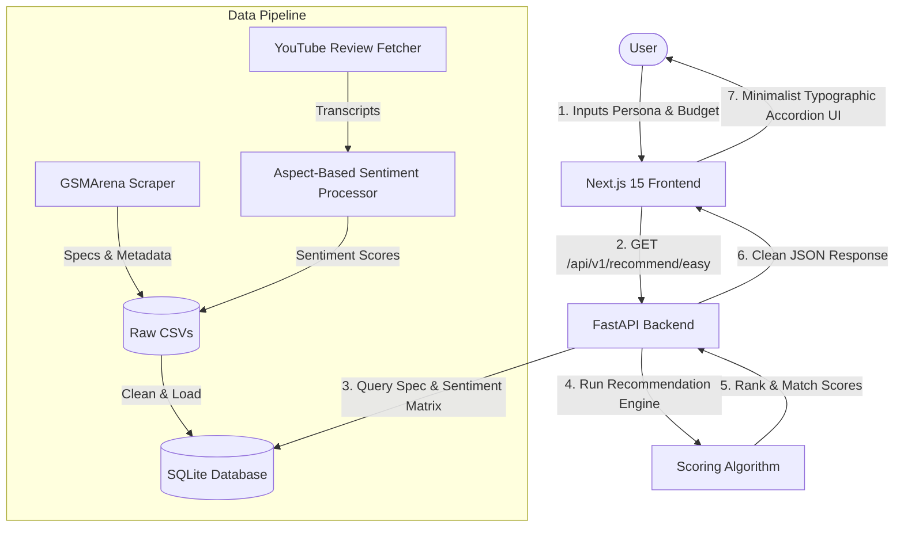

# 📱 Phonos.ai
<p align="center">
  <em>An Intelligent, Persona-Based Smartphone Recommender System for the Indian Market</em>
</p>

<p align="center">
  
  
  
  
  
</p>

---

## 🎯 Project Overview & Problem Solved

### The Problem
The Indian smartphone market is one of the most saturated, fast-paced, and confusing consumer electronics spaces in the world. Consumers face **cognitive overload** due to:
1.  **Deceptive Marketing Specs:** Numbers like "200 MP cameras" or "24 GB RAM" don't reflect actual real-world performance.
2.  **Rapid Release Cycles:** Phones become outdated or unavailable within months, making reviews from last year irrelevant.
3.  **Scattered Sentiment:** Finding honest feedback requires hours of reading blogs and watching YouTube reviews.
4.  **Complex Budgets:** Pricing (in ₹) fluctuates wildly across e-commerce platforms (Amazon, Flipkart).

### The Solution: Phonos.ai
**Phonos.ai** is a premium, data-driven smartphone intelligence recommender. It bypasses marketing hype by scoring devices mathematically. By analyzing raw technical specifications, real-time pricing, aspect-based review sentiments, and release dates, Phonos.ai generates a custom **Match Score** tailored to specific user personas (e.g., Gamer, Photographer, Value Seeker) and budgets.

---

## 🏗️ Architecture & How It Works

Phonos.ai is structured as a **Monorepo** consisting of two main sub-applications (Frontend & Backend) alongside an independent data scraping and analysis pipeline.



---

## 🛠️ The Tech Stack

### Frontend (`apps/web`)
*   **Framework:** Next.js 15 (App Router) with React & TypeScript.
*   **Styling:** Custom Vanilla CSS for high-performance micro-animations, absolute layout control, and custom glassmorphism.
*   **Typography:** Premium fonts including **Cabinet Grotesk** (display headings), **Satoshi** (body text), and **JetBrains Mono** (technical data and specifications).
*   **Design Paradigm:** Typographic Accordion layout — clean, high-contrast, image-less design that presents dense data elegantly without relying on basic grid cards.

### Backend (`apps/api`)
*   **Framework:** FastAPI (Python 3.11) utilizing asynchronous request handling.
*   **Database:** SQLite loaded with `aiosqlite` for asynchronous connection pooling and zero-latency lookups.
*   **Server:** Uvicorn.

### Data Engine & Scrapers (`data_engine/`)
*   **Specs Collector:** `gsmarena_scraper.py` parses detailed specs, models, and brands.
*   **YouTube Sentiment:** `youtube_fetcher.py` pulls transcripts of popular tech reviews.
*   **ABSA Processor:** `absa_processor.py` analyzes reviews to rate specific aspects (performance, battery, display) on a scale of `-1.0` to `+1.0`.

---

## ✨ Features & What Has Been Done Till Now

### 1. Unified Monorepo & Folder Restructuring
*   Consolidated the web application (`apps/web` & `apps/api`) with the data engineering pipeline (`data_engine`) and deep research reports (`research/`) under a single Git workspace.
*   Configured a production-ready `.gitignore` that safely excludes heavy datasets (`*.csv`, `*.xlsx`) and system caches, while preserving source code and the production SQLite database.

### 2. High-Performance FastAPI Backend
*   **SQLite Async Pipeline:** Reconfigured the database layer to utilize `aiosqlite` for asynchronous SQLite connections.
*   **Core Scoring Algorithm (`recommender.py`):** Calculates scores dynamically based on:
    *   **Price Tiers:** Compares specs against other phones in the exact same budget bracket to ensure fair ratios.
    *   **Persona Weights:** Gamer (weight on processor/display rate), Photographer (weight on camera sensors/setup), Budget Buyer (weight on value-for-money).
    *   **Sentiment Modifiers:** Modifies technical ratings using real-world aspect-based YouTube review sentiments.
    *   **Freshness Factor:** penalizes old models and prioritizes recently released devices.

### 3. Awwwards-Level Frontend UI
*   **Responsive Wizard Forms:** An elegant multi-step setup flow for selecting personas and budgets (utilizing Indian Rupee format `₹`).
*   **Minimalist Typographic Accordion:** Replaced standard image-heavy cards with a typography-first list layout. Clicking on a row smoothly expands to show a breakdown of strengths, compromises, and match scores.
*   **GSMArena-Style Spec Modal:** Clicking "View Full Specs" opens a professional, categorised popup parsing deep specification dictionaries (Network, Launch, Body, Display, Platform, Memory, Camera, Sound, Comms, Features, Battery, Misc).
*   **Zero Emojis:** Standardized all UI messages using crisp SVG iconography for a clean, developer-centric dashboard aesthetic.

---

## 🚦 Future Work

1.  **Live Price Scrapers:** Build cron-scheduled runners to poll real-time pricing from Amazon India and Flipkart APIs to update database records.
2.  **Semantic Search (pgvector):** Migrate back to PostgreSQL in production to utilize `pgvector` for natural language searches (e.g., *"Show me phones with great battery life that look like an iPhone"*).
3.  **Automated YouTube Pipeline:** Automate the transcript analysis pipeline to process new review videos as soon as they are uploaded.
4.  **Deployment Pipelines:** Implement CI/CD via GitHub Actions to deploy:
    *   Frontend to Vercel.
    *   Backend to Hugging Face Spaces (Docker-based) for an always-on free instance.

---

## 🚀 Quick Start Guide

### Prerequisites
*   [Node.js 20+](https://nodejs.org/)
*   [Python 3.11+](https://www.python.org/)
*   [Docker](https://www.docker.com/) (Optional, for containerized runs)

### Installation & Run

1.  **Clone the Repository:**
    ```bash
    git clone https://github.com/SujalChhajed925/Phonos.ai.git
    cd Phonos.ai
    ```

2.  **Run the Backend (FastAPI):**
    ```bash
    cd apps/api
    # Create virtual environment
    python -m venv .venv
    source .venv/bin/activate  # On Windows use: .venv\Scripts\activate
    pip install -r requirements.txt
    
    # Configure env variables (Create a .env file based on .env.example)
    cp .env.example .env
    
    # Run the server
    uvicorn app.main:app --reload --port 8000
    ```
    The interactive Swagger API docs will be available at [http://localhost:8000/docs](http://localhost:8000/docs).

3.  **Run the Frontend (Next.js):**
    ```bash
    cd ../web
    npm install
    npm run dev
    ```
    Open your browser and navigate to [http://localhost:3000](http://localhost:3000).

### Running via Docker Compose (Alternative)
To spin up the infrastructure containerized:
```bash
docker compose up --build
```

---

## 📄 License
This project is licensed under the MIT License.
