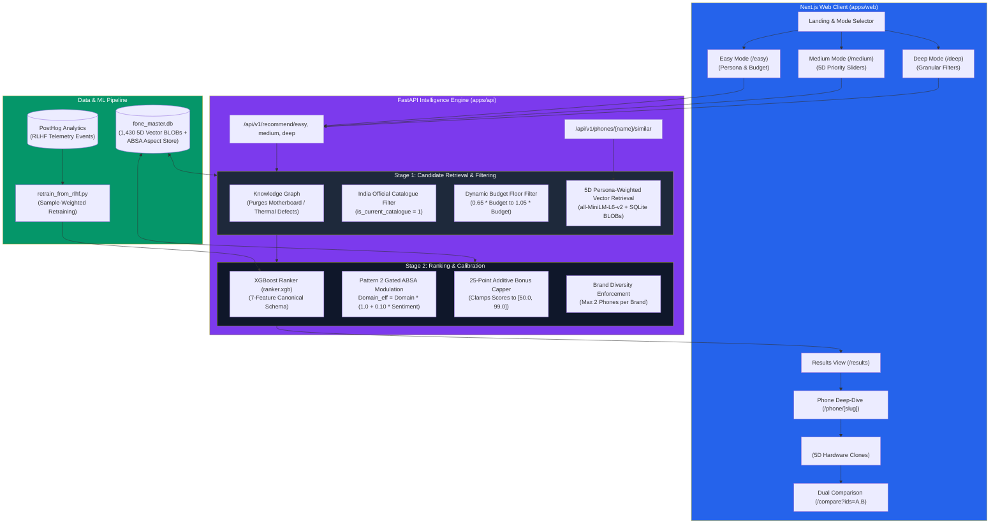

# 📱 Phonos.ai

<p align="center">
  <em>An Intelligent, SOTA Machine Learning Smartphone Recommender & Hardware Intelligence Platform for the Indian Market</em>
</p>

<p align="center">
  
  
  
  
  
  
  
</p>

---

## 🎯 Executive Overview & Problem Solved

### The Problem
The Indian smartphone market is one of the most saturated, fast-paced, and confusing consumer electronics spaces in the world. Consumers face **severe cognitive overload** due to:
1. **Deceptive Marketing Specifications:** Inflated metrics like "200 MP cameras" or "24 GB Extended RAM" frequently mask inferior sensors, throttling silicon, or poor display calibration.
2. **Rapid Release Cycles & Stale Catalogues:** Global databases contain unreleased devices or outdated models from 2021–2023 with no active retail availability in India.
3. **Fragmented Aspect Sentiment:** Finding authentic feedback requires hours of reading reviews across YouTube, forums, and tech blogs.
4. **Volatile Indian Pricing (₹):** Inconsistent discounts, coupon pricing, and fluctuating MSRP across Amazon India, Flipkart, and Croma.

### The Solution: Phonos.ai
**Phonos.ai** is a production-grade, full-stack smartphone intelligence engine. It replaces biased marketing hype with a **2-Stage Deep Learning & Ranking Model (DLRM)**:
* **Stage 1 (Retrieval & Filtering):** Persona-weighted vector retrieval, 5D hardware spec cosine clustering, Knowledge Graph defect shielding, and strict India Official Catalogue verification.
* **Stage 2 (Ranking & Calibration):** XGBoost ranking model trained on canonical features, Gated Aspect-Based Sentiment Analysis (ABSA), 25-point additive bonus capping, and anti-monopoly brand diversity enforcement.

---

## 🏗️ System Architecture


```mermaid
flowchart TD
    subgraph UI["Next.js Web Client (apps/web)"]
        Landing["Landing & Mode Selector"] --> Easy["Easy Mode (/easy)\n(Persona & Budget)"]
        Landing --> Medium["Medium Mode (/medium)\n(5D Priority Sliders)"]
        Landing --> Deep["Deep Mode (/deep)\n(Granular Filters)"]
        
        Results["Results View (/results)"]
        Report["Phone Deep-Dive (/phone/[slug])"]
        Compare["Dual Comparison (/compare?ids=A,B)"]
        
        Report --> SimComp["<SimilarPhones />\n(5D Hardware Clones)"]
        SimComp --> Compare
    end

    subgraph API["FastAPI Intelligence Engine (apps/api)"]
        RecEndpoint["/api/v1/recommend/easy, medium, deep"]
        SimEndpoint["/api/v1/phones/{name}/similar"]
        
        subgraph Stage1["Stage 1: Candidate Retrieval & Filtering"]
            KG["Knowledge Graph\n(Purges Motherboard / Thermal Defects)"]
            Catalogue["India Official Catalogue Filter\n(is_current_catalogue = 1)"]
            BudgetFilter["Dynamic Budget Floor Filter\n(0.65 * Budget to 1.05 * Budget)"]
            CosineRetrieval["5D Persona-Weighted Vector Retrieval\n(all-MiniLM-L6-v2 + SQLite BLOBs)"]
        end

        subgraph Stage2["Stage 2: Ranking & Calibration"]
            XGB["XGBoost Ranker (ranker.xgb)\n(7-Feature Canonical Schema)"]
            GatedABSA["Pattern 2 Gated ABSA Modulation\nDomain_eff = Domain * (1.0 + 0.10 * Sentiment)"]
            BonusCapper["25-Point Additive Bonus Capper\n(Clamps Scores to [50.0, 99.0])"]
            BrandDiv["Brand Diversity Enforcement\n(Max 2 Phones per Brand)"]
        end
    end

    subgraph DataStore["Data & ML Pipeline"]
        DB[("fone_master.db\n(1,430 5D Vector BLOBs +\nABSA Aspect Store)")]
        PostHog[("PostHog Analytics\n(RLHF Telemetry Events)")]
        Retrainer["retrain_from_rlhf.py\n(Sample-Weighted Retraining)"]
        PostHog --> Retrainer
        Retrainer --> XGB
    end

    Easy & Medium & Deep --> RecEndpoint
    SimEndpoint --> CosineRetrieval
    RecEndpoint --> Stage1
    Stage1 --> Stage2
    Stage2 --> Results
    Results --> Report
    DB <--> Stage1
    DB <--> Stage2

    style UI fill:#2563eb,color:#fff
    style API fill:#7c3aed,color:#fff
    style Stage1 fill:#1e293b,color:#fff
    style Stage2 fill:#0f172a,color:#fff
    style DataStore fill:#059669,color:#fff
```

---

## ⚡ Core Features & Engineering Upgrades

### 1. 2-Stage DLRM Machine Learning Ranker
* **Stage 1 (Vector Retrieval):** Converts user personas or priority slider weights into a 5-dimensional query vector matching the normalized hardware vector space:
  $$\vec{q} = \left[ \omega_{\text{soc}}, \omega_{\text{camera}}, \omega_{\text{display}}, \omega_{\text{battery}}, \omega_{\text{build}} \right]$$
* **Stage 2 (XGBoost Scoring):** Employs a pre-trained gradient-boosted decision tree (`ranker.xgb`) evaluated on a unified 7-feature schema:
  $$\text{Features} = \left[ \text{persona\_id}, \frac{\text{budget}}{\text{price}}, \frac{\text{price}}{\text{max\_price}}, \text{battery}_{\text{norm}}, \text{ram}_{\text{norm}}, \text{hz}_{\text{norm}}, \text{perf\_tier} \right]$$

### 2. Pattern 2 Gated ABSA (Aspect-Based Sentiment Analysis)
Rather than naive flat bonuses that distort hardware quality, Phonos.ai modulates each hardware domain score directly using real-world reviewer sentiment:
$$\text{DomainScore}_{\text{effective}} = \text{DomainScore}_{\text{raw}} \times \left(1.0 + 0.10 \times \text{ABSA\_Sentiment}\right)$$
* Aspects analyzed: `absa_camera`, `absa_battery`, `absa_performance`, `absa_display`, `absa_build`.
* Generates contextual **Reviewer Acclaim** match reasons ($\ge +0.25$) and **Reviewer Caution** trade-off warnings ($\le -0.15$).

### 3. 5D Hardware Vector Embeddings & Similar Phones Engine
* **1,430 L2-Normalized Vector BLOBs:** Pre-computed 5-dimensional hardware vectors stored directly in SQLite for instant retrieval.
* **In-Memory Cosine Similarity Matrix:** Instantaneous device-to-catalogue spec clustering ($O(N)$ vector dot product with zero GPU overhead).
* **API Endpoint:** `GET /api/v1/phones/{name}/similar?top_k=4&max_budget=...` returns the closest hardware spec clones.
* **Frontend UI Component (`<SimilarPhones />`):** Displays match percentage badges (e.g. `98% MATCH`), brand badges, formatted INR pricing, and direct 1-click comparison routes (`/compare?ids=A,B`).

### 4. Interactive Recommendation Modes
* **🟢 Easy Mode (`/easy`):** Natural language intent & persona wizard (Student, Gamer, Creator, Professional, Clean UI Purist).
* **🟡 Medium Mode (`/medium`):** Interactive continuous priority sliders (Performance, Camera, Battery, Display, Build) dynamically modifying hardware weights.
* **🔵 Deep Mode (`/deep`):** Granular constraint-based filtering for power users.

### 5. Knowledge Graph Defect & Lifecycle Shielding
* **Defect Purging:** Automatic pre-filtering of devices with known hardware defect histories (e.g., motherboard failures or severe thermal throttling chipsets).
* **Lifecycle Aging Penalty:** 2023/2024 flagships priced above ₹70,000 receive an automated lifecycle penalty to prevent outdated flagships from overtaking modern sub-flagships.
* **Anti-Stacking 25-Point Bonus Cap:** Additive keyword boosts are strictly capped at 25.0 points, clamping final scores to $[50.0, 99.0]$.
* **Anti-Monopoly Brand Diversity:** Enforces a maximum of 2 devices per manufacturer in the top-5 recommendations.

### 6. Closed-Loop RLHF (Reinforcement Learning from Human Feedback)
* Enriched PostHog telemetry hooks capture user interactions (`buy_clicked`, `phone_rejected`, `phone_expanded`) along with search context (`persona`, `budget`, `mode`).
* `retrain_from_rlhf.py` converts real user feedback into sample-weighted pairwise training instances to continuously adapt the XGBoost model over time.

---

## 🛠️ Tech Stack

### Frontend (`apps/web`)
* **Framework:** Next.js 16 (App Router) + React 19 + TypeScript.
* **Styling:** Custom CSS Modules following an ultra-clean Swiss Design aesthetic.
* **Typography:** Cabinet Grotesk (Display Headings), Satoshi (Body Text), JetBrains Mono (Technical Spec Matrices).
* **Analytics & Telemetry:** PostHog React SDK (`posthog-js`).

### Backend (`apps/api`)
* **Framework:** FastAPI (Python 3.11+) with asynchronous ASGI request processing.
* **Machine Learning:** XGBoost (`xgboost`), NumPy, Scikit-learn, VADER Sentiment (`nltk.sentiment.vader`).
* **Embeddings:** `sentence-transformers` (`all-MiniLM-L6-v2`).
* **Database:** SQLite with `aiosqlite` asynchronous connection pool.
* **Graph Logic:** NetworkX (`networkx`).

---

## 📁 Repository Structure

```
Phonos.ai/
├── apps/
│   ├── api/
│   │   ├── app/
│   │   │   ├── db/                 # Database connection pool & async queries
│   │   │   ├── models/             # Pydantic data schemas (PhoneDetails, Query, Response)
│   │   │   ├── routers/            # API endpoints (recommend, phones, search, health)
│   │   │   └── services/           # ML ranker, hardware scorer, similarity, ABSA, KG
│   │   ├── data/                   # SQLite database (fone_master.db) & XGBoost model (ranker.xgb)
│   │   ├── scripts/                # Data ingestion, vector builder, ABSA scorer, RLHF retrainer
│   │   └── tests/                  # 38 granular Pytest unit & integration tests
│   │
│   └── web/
│       ├── src/
│       │   ├── app/                # Next.js App Router (easy, medium, deep, results, phone/[slug], compare)
│       │   ├── components/         # UI components (PhoneReport, SimilarPhones, PhoneRow, ResultsAccordion)
│       │   └── lib/                # API client, types, spec formatting helpers
│       └── public/                 # Static assets & font definitions
│
├── data_engine/                    # GSMArena & YouTube sentiment scrapers
└── docker-compose.yml              # Monorepo containerization configuration
```

---

## 🧪 Comprehensive Test Suite & Validation

The recommendation engine is covered by **38 automated unit, integration, and edge-case tests**:

```bash
cd apps/api
.venv\Scripts\pytest.exe -v tests/
```

```
tests/test_recommendation_edge_cases.py (15 edge cases) ........... PASSED [ 39%]
tests/test_recommendation_engine.py (15 ML tests)      ........... PASSED [ 78%]
tests/test_official_catalogue_scraper.py (7 scraper tests) ....... PASSED [ 97%]
tests/test_health.py (1 health check)                  ........... PASSED [100%]

======================= 38 passed in 56.13s =======================
```

### Live Scenario Simulation Runner
To test the engine against the live database across 10 real-world buyer profiles:
```bash
.venv\Scripts\python.exe scripts/test_engine_scenarios.py
```

```
====================================================================================================
PHONOS.AI RECOMMENDATION ENGINE — LIVE SCENARIO TEST SUITE
====================================================================================================
# SCENARIO                             | STATUS | TOP RECOMMENDATION               | SCORE | PRICE (INR)
----------------------------------------------------------------------------------------------------
1. Ultra-Low Budget Student            | PASS   | Motorola Moto G 5G 2026          | 98.4  | Rs.    9,999
2. Mid-Range BGMI Competitive Gamer    | PASS   | realme Realme GT 7 Pro           | 94.7  | Rs.   34,999
3. 4K HDR Vlog & Reels Creator         | PASS   | Vivo Vivo X200 Pro Optics        | 99.0  | Rs.   54,999
4. Pure Clean Stock OS Purist          | PASS   | Motorola Edge 60 Pro             | 92.0  | Rs.   29,645
5. Ultra Flagship Executive            | PASS   | Samsung Galaxy S26 Ultra         | 87.2  | Rs.  124,999
6. Medium Mode 80% Battery Focus       | PASS   | Oppo Oppo A6 5G                  | 99.0  | Rs.   21,999
7. Medium Mode 80% Silicon Focus       | PASS   | realme Realme 16                 | 99.0  | Rs.   27,990
8. Hardware Spec Clones (S26 Ultra)    | PASS   | Samsung Galaxy F36 5G            | 99.9  | Rs.   21,999
9. Hardware Spec Clones (Budget 5G)    | PASS   | Motorola Moto G05                | 99.6  | Rs.    7,999
10. Tight Budget Squeeze Optimization  | PASS   | Oppo Oppo K13                    | 84.0  | Rs.   16,817
====================================================================================================
✅ ALL 10 LIVE SCENARIOS VALIDATED SUCCESSFULLY WITHOUT ERRORS.
====================================================================================================
```

---

## 🚀 Quick Start Guide

### Prerequisites
* **Node.js:** 20.x or higher
* **Python:** 3.11.x or higher
* **Git**

---

### 1. Clone & Setup Backend

```bash
# Clone the repository
git clone https://github.com/Dragonballsuper-1995/Phonos.ai.git
cd Phonos.ai

# Setup FastAPI Virtual Environment
cd apps/api
python -m venv .venv

# Activate Virtual Environment:
# On Windows (PowerShell):
.venv\Scripts\Activate.ps1
# On macOS / Linux:
source .venv/bin/activate

# Install Dependencies
pip install -r requirements.txt

# Start FastAPI Server
uvicorn app.main:app --reload --port 8000
```
* Interactive API Documentation (Swagger UI): [http://localhost:8000/docs](http://localhost:8000/docs)
* Health Check Endpoint: [http://localhost:8000/api/v1/health](http://localhost:8000/api/v1/health)

---

### 2. Setup & Run Frontend

In a separate terminal:
```bash
cd apps/web

# Install npm packages
npm install

# Start Next.js Development Server
npm run dev
```
Open [http://localhost:3000](http://localhost:3000) in your browser.

---

### 3. Running via Docker Compose

```bash
docker compose up --build
```

---

## 📄 License
This project is licensed under the **MIT License**.
