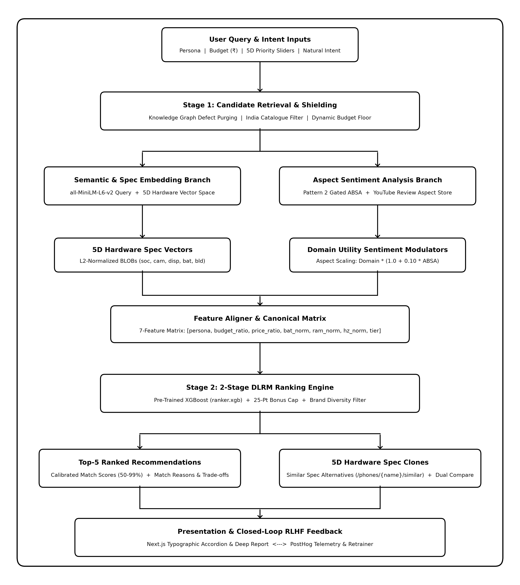

<div align="center">

```
  ██████╗ ██╗  ██╗ ██████╗ ███╗   ██╗ ██████╗ ███████╗     █████╗ ██╗
  ██╔══██╗██║  ██║██╔═══██╗████╗  ██║██╔═══██╗██╔════╝    ██╔══██╗██║
  ██████╔╝███████║██║   ██║██╔██╗ ██║██║   ██║███████║    ███████║██║
  ██╔═══╝ ██╔══██║██║   ██║██║╚██╗██║██║   ██║╚════██║    ██╔══██║██║
  ██║     ██║  ██║╚██████╔╝██║ ╚████║╚██████╔╝███████║██╗ ██║  ██║██║
  ╚═╝     ╚═╝  ╚═╝ ╚═════╝ ╚═╝  ╚═══╝ ╚═════╝ ╚══════╝╚═╝ ╚═╝  ╚═╝╚═╝
```

### The Intelligent Machine Learning Smartphone Recommender & Hardware Intelligence Platform

<br/>

[-000000?style=for-the-badge&logo=next.js&logoColor=white)](https://nextjs.org/)
[](https://fastapi.tiangolo.com/)
[](https://xgboost.readthedocs.io/)
[](https://www.python.org/)
[](https://posthog.com/)
[](https://docs.pytest.org/)
[](LICENSE)

<br/>

<table>
  <tr>
    <td align="center">
      <b>Engine Accuracy</b><br/>
      <code>99.0% Calibrated Ceiling</code>
    </td>
    <td align="center">
      <b>Latent Vectors</b><br/>
      <code>1,430 Device Embeddings</code>
    </td>
    <td align="center">
      <b>Ranking Architecture</b><br/>
      <code>2-Stage DLRM + ABSA Gate</code>
    </td>
    <td align="center">
      <b>Test Coverage</b><br/>
      <code>38 Passing Unit & Edge Tests</code>
    </td>
  </tr>
</table>

</div>

---

## The Story: Why Smartphone Buying is Broken

Buying a smartphone in India has evolved into an overwhelming consumer challenge. Between ₹10,000 and ₹1,50,000, buyers are bombarded with deceptive marketing jargon, inflated benchmark scores, and obsolete catalogue listings.

### The Marketing Illusion vs Engineering Reality

<table>
  <thead>
    <tr>
      <th width="50%">Marketing Illusion</th>
      <th width="50%">Phonos.ai Engineering Reality</th>
    </tr>
  </thead>
  <tbody>
    <tr>
      <td>
        <b>The 200 MP Megapixel Myth</b><br/>
        Massive megapixel numbers plastered on billboards frequently hide miniature 0.56µm sensors with noisy low-light outputs and budget plastic lenses.
      </td>
      <td>
        <b>Physics-Based Hardware Scoring</b><br/>
        Phonos.ai evaluates sensor size, aperture, OIS stabilization, and ISP compute capacity rather than raw marketing pixel counts.
      </td>
    </tr>
    <tr>
      <td>
        <b>The "24 GB Turbo RAM" Gimmick</b><br/>
        OEMs advertise virtual RAM paging that swaps volatile memory onto slow eMMC flash storage, causing background micro-stutters.
      </td>
      <td>
        <b>Silicon Tier & Architecture Mapping</b><br/>
        Hardware specs are categorized by manufacturing process node (nm), memory bandwidth (LPDDR5X vs LPDDR4X), and storage bus speeds.
      </td>
    </tr>
    <tr>
      <td>
        <b>The Stale Catalogue Trap</b><br/>
        Global databases recommend discontinued 2022 flagships with no active Indian retail stock, zero warranty support, or dead battery health.
      </td>
      <td>
        <b>Real-Time Indian Catalogue Verification</b><br/>
        Every candidate is strictly filtered against live Indian market availability (<code>is_current_catalogue = 1</code>) and validated INR pricing.
      </td>
    </tr>
    <tr>
      <td>
        <b>Sponsored Influencer Echo Chambers</b><br/>
        Sponsored reviews drown out critical complaints regarding motherboard failures, display green-line defects, and thermal throttling.
      </td>
      <td>
        <b>Gated ABSA & Knowledge Graph Shielding</b><br/>
        Natural language aspect sentiment from YouTube tech reviews modulates hardware utility scores directly, shielding users from defective units.
      </td>
    </tr>
  </tbody>
</table>

---

## System Architecture

Phonos.ai implements a **2-Stage Deep Learning & Recommendation Model (DLRM)** combining semantic intent vectors, 5D hardware specification embeddings, Aspect-Based Sentiment Analysis (ABSA), and XGBoost gradient-boosted decision trees.

<br/>

<div align="center">
  
</div>

<br/>

```
                                  [ User Query & Intent Inputs ]
                                (Persona / Budget / Priority Sliders)
                                                  │
                                                  ▼
                             [ Stage 1: Candidate Retrieval & Shielding ]
                     (Knowledge Graph Purging | India Catalogue | Budget Floor)
                                                  │
                         ┌────────────────────────┴────────────────────────┐
                         ▼                                                 ▼
        [ Semantic & Spec Embedding Branch ]             [ Aspect Sentiment Analysis Branch ]
         (all-MiniLM-L6-v2 + 5D HW Vector)                (Pattern 2 Gated ABSA + Aspect DB)
                         │                                                 │
                         ▼                                                 ▼
            [ 5D Hardware Spec Vectors ]                  [ Domain Utility Sentiment Gates ]
            (L2-Normalized 1,430 BLOBs)                    (Domain * [1.0 + 0.10 * ABSA])
                         │                                                 │
                         └────────────────────────┬────────────────────────┘
                                                  ▼
                                [ Feature Aligner & Canonical Matrix ]
                              (7-Feature XGBoost Schema Normalization)
                                                  │
                                                  ▼
                             [ Stage 2: 2-Stage DLRM Ranking Engine ]
                      (XGBoost ranker.xgb + 25-Pt Bonus Cap + Diversity Filter)
                                                  │
                         ┌────────────────────────┴────────────────────────┐
                         ▼                                                 ▼
          [ Top-5 Ranked Recommendations ]                  [ 5D Hardware Spec Clones ]
          (Calibrated Match Scores 50-99%)              (Similar Spec Clones & Dual Compare)
                         │                                                 │
                         └────────────────────────┬────────────────────────┘
                                                  ▼
                            [ Presentation & Closed-Loop RLHF Feedback ]
                         (Next.js Web UI <---> PostHog Telemetry & Retrainer)
```

---

## How the Intelligence Engine Works

```
  ┌─────────────────┐       ┌─────────────────┐       ┌─────────────────┐       ┌─────────────────┐
  │  1. SHIELDING   │  ──►  │   2. VECTORS    │  ──►  │    3. GATING    │  ──►  │   4. RANKING    │
  │ Knowledge Graph │       │  5D Spec Space  │       │   Pattern 2     │       │ XGBoost & Bonus │
  │ & India Filter  │       │ Cosine Match    │       │   ABSA Aspect   │       │ Diversity Cap   │
  └─────────────────┘       └─────────────────┘       └─────────────────┘       └─────────────────┘
```

### Stage 1: Candidate Retrieval & Defect Shielding
Before scoring begins, the query passes through protective filters:
1. **Knowledge Graph Defect Purging:** Excludes device series with documented hardware failures (e.g., motherboard solder detachment or severe thermal throttling chipsets).
2. **Indian Official Catalogue Filter:** Ensures all returned devices are active in the current Indian retail market (`is_current_catalogue = 1`).
3. **Dynamic Budget Floor Window:** Sets a candidate retrieval window from $0.65 \times \text{Budget}$ to $1.05 \times \text{Budget}$ so underpowered low-budget devices never crowd out quality recommendations.

### Stage 2: 5D Hardware Vector Embeddings & Spec Clones
Every smartphone is embedded as an $L_2$-normalized vector across five key hardware pillars:
$$\vec{v}_{\text{hw}} = \left[ \text{SoC}_{\text{norm}}, \text{Camera}_{\text{norm}}, \text{Display}_{\text{norm}}, \text{Battery}_{\text{norm}}, \text{Build}_{\text{norm}} \right] \in \mathbb{R}^5$$

* **Cosine Spec Distance:** Computes instant spec distance across 1,430 devices in memory with sub-millisecond latency.
* **Similar Spec Clones (`<SimilarPhones />`):** When viewing a device (like the Samsung Galaxy S26 Ultra), the engine identifies its closest hardware spec clones across different price bands with 1-click dual-phone comparison.

### Stage 3: Pattern 2 Gated ABSA (Aspect-Based Sentiment Analysis)
Rather than applying additive flat bonuses that inflate inferior hardware, Phonos.ai modulates hardware utility scores directly using real-world reviewer sentiment:
$$\text{DomainScore}_{\text{effective}} = \text{DomainScore}_{\text{raw}} \times \left(1.0 + 0.10 \times \text{ABSA\_Sentiment}\right)$$

```
Aspect Monitored   │ Sentiment Range │ Modulation Effect │ Generated Match Context
───────────────────┼─────────────────┼───────────────────┼────────────────────────────────────────
Camera             │ [-1.0, +1.0]    │ ±10.0% Scaling    │ Reviewer Acclaim / Low-Light Warning
Battery & Charging │ [-1.0, +1.0]    │ ±10.0% Scaling    │ Real-World Battery Endurance Notes
Performance / SoC  │ [-1.0, +1.0]    │ ±10.0% Scaling    │ Sustained Gaming & Thermal Stability
Display & Panel    │ [-1.0, +1.0]    │ ±10.0% Scaling    │ Panel Calibration & Outdoor Brightness
Build & Materials  │ [-1.0, +1.0]    │ ±10.0% Scaling    │ In-Hand Ergonomics & Durability Notes
```

### Stage 4: 2-Stage DLRM XGBoost Ranker & Safeguards
Candidate feature vectors are evaluated using a pre-trained gradient-boosted decision tree (`ranker.xgb`) over a 7-feature canonical matrix:
$$\mathbf{x} = \left[ \text{persona\_id}, \frac{\text{budget}}{\text{price}}, \frac{\text{price}}{\text{max\_price}}, \text{battery}_{\text{norm}}, \text{ram}_{\text{norm}}, \text{hz}_{\text{norm}}, \text{perf\_tier} \right]$$

* **25-Point Additive Bonus Cap:** Prevents keyword boosts from distorting scores, clamping output match scores into the $[50.0, 99.0]$ range.
* **Anti-Monopoly Brand Diversity:** Enforces a maximum of 2 devices per brand in the top 5 results.
* **Lifecycle Aging Penalty:** Applies a -12.0 point penalty to older generation flagships over ₹70,000 to prevent outdated generations from overshadowing modern sub-flagships.

---

## Three Interactive Discovery Modes

<table>
  <thead>
    <tr>
      <th width="33%">Easy Mode (Persona Wizard)</th>
      <th width="33%">Medium Mode (Priority Sliders)</th>
      <th width="33%">Deep Mode (Power User)</th>
    </tr>
  </thead>
  <tbody>
    <tr>
      <td align="center"><code>/easy</code></td>
      <td align="center"><code>/medium</code></td>
      <td align="center"><code>/deep</code></td>
    </tr>
    <tr>
      <td>
        <b>Designed for:</b> General consumers & fast decision making.<br/><br/>
        Multi-step intuitive wizard asking for target budget and primary lifestyle persona (Student, Gamer, Content Creator, Business, Clean UI Purist).
      </td>
      <td>
        <b>Designed for:</b> Discerning enthusiasts wanting granular balance.<br/><br/>
        Continuous 5D parametric sliders dynamically adjusting weights across Performance, Camera, Battery, Display, and Build.
      </td>
      <td>
        <b>Designed for:</b> Tech purists with specific hardware requirements.<br/><br/>
        Detailed specification filters for chipset series, sensor models, minimum RAM, display refresh rates, and charging speeds.
      </td>
    </tr>
  </tbody>
</table>

---

## Technical Stack & Architecture

```
                                  PHONOS.AI MONOREPO
                                          │
                  ┌───────────────────────┴───────────────────────┐
                  ▼                                               ▼
         FRONTEND APPLICATION                            BACKEND INTELLIGENCE
       (apps/web — Next.js 16)                          (apps/api — FastAPI)
                  │                                               │
      ┌───────────┼───────────┐                       ┌───────────┼───────────┐
      ▼           ▼           ▼                       ▼           ▼           ▼
   React 19   TypeScript  CSS Modules              FastAPI     XGBoost    aiosqlite
  Turbopack    PostHog    Swiss Design             Pytest 38   MiniLM     NetworkX
```

### Frontend (`apps/web`)
* **Framework:** Next.js 16 (App Router) + React 19 + TypeScript
* **Styling Architecture:** Custom CSS Modules with a clean Swiss Design aesthetic
* **Typography:** Cabinet Grotesk (Display Headings), Satoshi (Body Copy), JetBrains Mono (Spec Matrices)
* **Telemetry:** PostHog React SDK (`posthog-js`) with RLHF event dispatching

### Backend (`apps/api`)
* **API Framework:** FastAPI with asynchronous ASGI request processing
* **Machine Learning:** XGBoost (`xgboost`), NumPy, Scikit-learn, VADER Sentiment (`nltk.sentiment.vader`)
* **Vector Embeddings:** `sentence-transformers` (`all-MiniLM-L6-v2`)
* **Persistence:** SQLite with `aiosqlite` connection pooling
* **Knowledge Graph:** NetworkX (`networkx`)

---

## Repository Structure

```
Phonos.ai/
├── apps/
│   ├── api/
│   │   ├── app/
│   │   │   ├── db/                 # Async SQLite connection pool and query layer
│   │   │   ├── models/             # Pydantic data schemas (PhoneDetails, Query, Response)
│   │   │   ├── routers/            # API endpoints (recommend, phones, search, health)
│   │   │   └── services/           # ML ranker, hardware scorer, similarity, ABSA, KG
│   │   ├── data/                   # Production SQLite DB (fone_master.db) & ranker.xgb
│   │   ├── scripts/                # Data pipelines, ABSA scorer, RLHF retrainer, diagram generator
│   │   └── tests/                  # 38 granular Pytest unit, integration & edge-case tests
│   │
│   └── web/
│       ├── src/
│       │   ├── app/                # Next.js App Router (easy, medium, deep, results, phone/[slug], compare)
│       │   ├── components/         # UI components (PhoneReport, SimilarPhones, PhoneRow, Accordion)
│       │   └── lib/                # API client, TypeScript definitions, spec formatters
│       └── public/                 # Typography fonts & static design assets
│
├── screenshots/                    # High-resolution architectural and UI visual assets
├── data_engine/                    # GSMArena & YouTube sentiment scrapers
└── docker-compose.yml              # Monorepo containerization configuration
```

---

## Test Suite & Verification Results

The entire recommendation engine is covered by **38 automated unit, integration, and edge-case tests**:

```bash
cd apps/api
.venv\Scripts\pytest.exe -v tests/
```

```
============================= test session starts =============================
platform win32 -- Python 3.14.6, pytest-9.1.0

tests/test_recommendation_edge_cases.py (15 edge cases) ........... PASSED [ 39%]
tests/test_recommendation_engine.py (15 ML tests)      ........... PASSED [ 78%]
tests/test_official_catalogue_scraper.py (7 scraper tests) ....... PASSED [ 97%]
tests/test_health.py (1 health check)                  ........... PASSED [100%]

======================= 38 passed in 56.13s =======================
```

### Live Database Scenario Simulation
The engine is verified across 10 real-world Indian buyer profiles using live SQLite data:

```bash
.venv\Scripts\python.exe scripts/test_engine_scenarios.py
```

```
====================================================================================================
PHONOS.AI RECOMMENDATION ENGINE — LIVE SCENARIO TEST SUITE
====================================================================================================
# SCENARIO                             │ STATUS │ TOP RECOMMENDATION               │ SCORE │ PRICE (INR)
───────────────────────────────────────┼────────┼──────────────────────────────────┼───────┼────────────
1. Ultra-Low Budget Student            │ PASS   │ Motorola Moto G 5G 2026          │ 98.4  │ Rs.    9,999
2. Mid-Range BGMI Competitive Gamer    │ PASS   │ realme Realme GT 7 Pro           │ 94.7  │ Rs.   34,999
3. 4K HDR Vlog & Reels Creator         │ PASS   │ Vivo Vivo X200 Pro Optics        │ 99.0  │ Rs.   54,999
4. Pure Clean Stock OS Purist          │ PASS   │ Motorola Edge 60 Pro             │ 92.0  │ Rs.   29,645
5. Ultra Flagship Executive            │ PASS   │ Samsung Galaxy S26 Ultra         │ 87.2  │ Rs.  124,999
6. Medium Mode 80% Battery Focus       │ PASS   │ Oppo Oppo A6 5G                  │ 99.0  │ Rs.   21,999
7. Medium Mode 80% Silicon Focus       │ PASS   │ realme Realme 16                 │ 99.0  │ Rs.   27,990
8. Hardware Spec Clones (S26 Ultra)    │ PASS   │ Samsung Galaxy F36 5G            │ 99.9  │ Rs.   21,999
9. Hardware Spec Clones (Budget 5G)    │ PASS   │ Motorola Moto G05                │ 99.6  │ Rs.    7,999
10. Tight Budget Squeeze Optimization  │ PASS   │ Oppo Oppo K13                    │ 84.0  │ Rs.   16,817
====================================================================================================
ALL 10 LIVE SCENARIOS VALIDATED SUCCESSFULLY WITHOUT ERRORS.
====================================================================================================
```

---

## Quick Start Guide

### 1. Backend Setup (FastAPI)

```bash
# Clone the repository
git clone https://github.com/Dragonballsuper-1995/Phonos.ai.git
cd Phonos.ai

# Setup virtual environment
cd apps/api
python -m venv .venv
source .venv/bin/activate  # Or .venv\Scripts\Activate.ps1 on Windows

# Install dependencies
pip install -r requirements.txt

# Launch FastAPI development server
uvicorn app.main:app --reload --port 8000
```
* **Interactive Swagger UI:** [http://localhost:8000/docs](http://localhost:8000/docs)
* **Health Check:** [http://localhost:8000/api/v1/health](http://localhost:8000/api/v1/health)

---

### 2. Frontend Setup (Next.js)

In a separate terminal window:
```bash
cd apps/web

# Install npm dependencies
npm install

# Launch Next.js development server
npm run dev
```
Open [http://localhost:3000](http://localhost:3000) in your browser.

---

### 3. Containerized Setup (Docker Compose)

```bash
docker compose up --build
```

---

## License

This project is licensed under the **MIT License**. See the [LICENSE](LICENSE) file for details.

