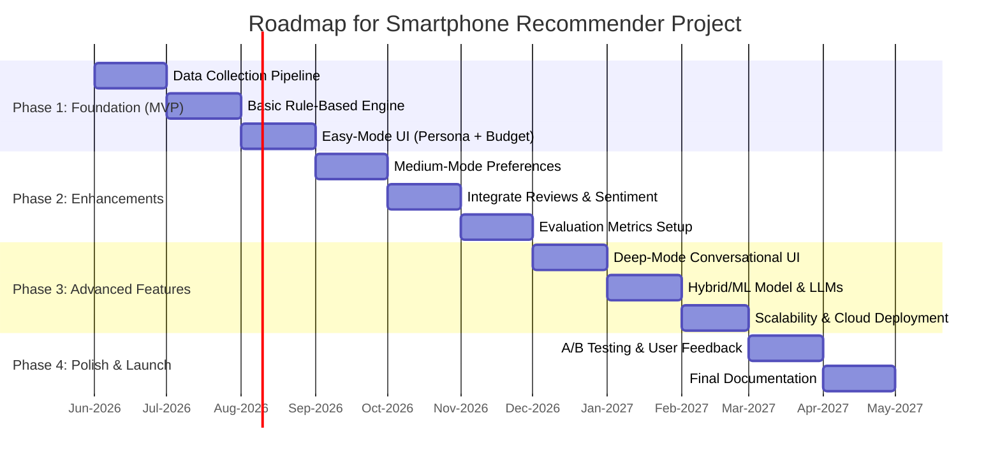

# AI-Based Smartphone Recommender: Project Analysis

## Executive Summary  
The smartphone market now offers thousands of models with varied features, overwhelming consumers. An AI-driven recommender can simplify choice by matching user needs (e.g. “best camera under £500”) to device specs and reviews. This report outlines a comprehensive design: defining user personas (from casual users to tech enthusiasts), gathering data (from GSMArena specs, brand sites, YouTube reviews, etc.), and engineering features (hardware specs, price, sentiment scores, recency). We compare model approaches (rule-based, content-based, collaborative, hybrid, LLM/embeddings) in a table, and propose evaluation metrics (precision@K, NDCG, user satisfaction, A/B tests). UI/UX will support three modes: *Easy* (persona + budget), *Medium* (task preference + budget), *Deep* (detailed history). Explainability (e.g. “this phone fits your top criteria”) and confidence scores enhance trust. Deployment considerations include scalable APIs (e.g. Python/Flask on AWS), mobile/web integration, caching for low latency. We address privacy (GDPR, brand IP), bias (e.g. popularity bias), and maintenance (frequent data updates, retraining). A phased roadmap spans data collection, MVP, enhancements, and launch (see timeline diagram below). Concrete choices are made for languages (Python, JavaScript), frameworks (FastAPI/React), databases (PostgreSQL/NoSQL), and hosting (AWS/GCP). 

## Problem Statement  
The explosion of smartphone models and features makes it hard for buyers to choose. **Objective**: build an intelligent recommender that suggests phones based on user input and device data. Specifically, the system must handle:  
- **Three interaction modes**: 
  - *Easy*: user selects a broad persona (e.g. “student on budget”) and budget.  
  - *Medium*: user specifies the strength they want (e.g. “best camera” or “top performance”) plus budget.  
  - *Deep*: user provides detailed history (current phone, usage patterns, interests like gaming/photography).  
- **Personalization**: incorporate user preferences into scoring (e.g. weighted features) so results align with needs.  
- **Real-world data**: integrate up-to-date specs, prices, and user opinions from multiple sources (GSMArena, brand sites, YouTube transcripts, reviews).  
- **Explainability and feedback**: clearly explain recommendations and allow user feedback.

Existing literature notes that customers face a “difficult task” selecting phones from many models. Prior systems (e.g. ChoseAmobile) use metrics and reviews to guide novices. We will adapt these ideas, adding modern machine-learning approaches (embeddings/LLMs) and rigorous evaluation.

## User Personas  
We identify representative personas to guide design:  

- **Budget-Conscious Student**: Values affordability, moderate performance, likes social media and music streaming. (May prioritize battery life and basic camera.)  
- **Photography Enthusiast**: Wants top camera quality (e.g. high megapixel, optical stabilization), moderate performance, willing to spend more.  
- **Mobile Gamer**: Demands high CPU/GPU performance and refresh rate, cares about cooling and battery, willing to pay mid to high budget.  
- **Business Professional**: Needs reliability, long battery, good display, security features, often brand-agnostic, mid-high budget.  
- **Elderly/Basic User**: Prefers ease of use (large display/icons, long battery), low to mid budget, cares less about cutting-edge specs.  

For *Easy* mode, the user can select a persona template (or enter free-text description) and a budget. For *Medium*, we may refine personas by task focus (e.g. “I prioritize camera performance”). In *Deep* mode, the system prompts through follow-up questions or free-form input, building a detailed profile (e.g. current phone model, disliked features, everyday uses). Persona design will follow UX best practices (demographic profile, goals, scenarios), but here it maps directly to filter criteria.

## Functional Requirements  
- **User Input**: Accept persona/category inputs as above. Capture *budget* (numeric or range) and *preferred criteria* (e.g. “battery life”, “camera quality”).  
- **Search/Filter**: Filter out devices beyond budget. Possibly filter by OS preference (Android/iOS) or size if given.  
- **Ranking**: Score remaining phones by matching features to user profile. For example, if user wants “best camera”, rank by camera specs and review sentiment. If user is a gamer, weight CPU/GPU benchmarks. The scoring may combine multiple factors with weights reflecting user priorities.  
- **Output**: Return a ranked list of recommended phones, each with brief key specs (e.g. “Phone X – 108MP camera, 5000mAh battery, 8GB RAM, £450”) and a short justification (e.g. “Highest camera rating under £500.”). Provide an overall confidence or match score for each.  
- **Modes**: Three modes must produce coherent flows:  
  - *Easy*: Only persona and budget; system uses default weights for that persona.  
  - *Medium*: Category selection (e.g. “camera”) and budget; use a fixed persona “tech enthusiast” with one criterion.  
  - *Deep*: Multi-turn; the system may ask additional questions (possibly via chatbot interface) to clarify usage, then compute recommendations.  
- **Data Update**: Automatically update device database (e.g. nightly) with new releases and prices.  
- **Explainability**: Provide explanations for why each phone was recommended (see later).  
- **Integration**: Offer an API endpoint (e.g. REST) to generate recommendations, so it can be embedded in a resume project (demo web or mobile app).  

## Data Requirements  
We need two main datasets: **Device inventory** and **Auxiliary information**.  

- **Phone Specifications Schema**: For each phone model, store attributes such as:  
  - Brand, Model Name, Release Date, Price (region-specific).  
  - Hardware specs: CPU (type, cores, benchmark score), GPU, RAM (GB), Storage (GB), Battery capacity (mAh), Display (size, type, resolution, refresh rate), Camera details (megapixels, aperture, number of lenses, video capability), OS, connectivity (5G, LTE, etc), sensors, unique features (waterproofing, stylus).  
  - Derived or categorical features: e.g. “performance score”, “camera quality rating” (if available), device weight, dimensions.  
  - Flags: “flagship” vs “budget” category, refurbished or new.  

- **User Data Schema**: For interactive mode, temporarily store:  
  - Persona description or user profile (text or structured choices).  
  - Usage patterns (questions answered).  
  - Budget (numeric).  
  - Past recommendations or chosen models (if tracking).  
  - (Note: we avoid storing sensitive personal info like name/location unless needed.)  

- **Data Sources & Acquisition**:  
  - **GSMArena**: Comprehensive specs database. We can scrape GSMArena pages (each model has a detailed spec sheet) or use existing APIs. Tools like the Apify “GSMArena Phone Specs Scraper” extract thousands of devices and fields. Kaggle also has GSMArena datasets (for reference). We should automate periodic scraping (e.g. weekly) to catch new releases.  
  - **Official Brand Sites**: Some manufacturers (Apple, Samsung, etc.) list specs on their websites. Scraping or using official product feeds (if available) can supplement data or verify GSMArena info. This may be semi-structured (HTML, PDFs). We should respect robots.txt and copyright, and use only factual specs.  
  - **YouTube Transcripts**: Text from smartphone review videos (unboxing/review) contains qualitative info and user sentiment. We can use the YouTube Data API or libraries (e.g. youtube-transcript-api) to fetch captions. These provide user and expert opinions on features (e.g. “camera performs well in low light”).  
  - **Review Sites (GSMArena, CNET, TechRadar, etc.)**: Extract user and editorial reviews. GSMArena often includes summary reviews and user opinions; others have features lists. Scrape or use RSS/feeds where available.  
  - **E-commerce/Price Data**: Price trackers or APIs (Google Shopping, Amazon) to get current prices. If not available, approximate using regional online stores or crowdsourced price lists.  
  - **Sentiment Data**: Perform sentiment analysis on text sources (YouTube comments, review text) to infer positive/negative aspects (battery life, performance). Tools like VADER or fine-tuned BERT can label sentiment. This data will feed into features (e.g. a “camera sentiment score”).  

- **Data Processing**:  
  - **Cleaning/Normalization**: Standardize units (mAh, inches, GB), handle missing fields (e.g. some phones list “No headphone jack”). Resolve naming variants (“OnePlus 9” vs “OnePlus 9 5G”). Remove duplicates (e.g. one model in multiple color/config entries).  
  - **Schema & Storage**: A relational database (PostgreSQL) or NoSQL store (MongoDB) can hold structured specs. For text (transcripts/reviews), use a document store or text index. Also consider a vector database (FAISS, Pinecone) for embedding-based retrieval.  
  - **Update Frequency**: Specs change mainly when new phones launch (weekly to monthly). Reviews are continuous. We can schedule full scrapes monthly, with incremental checks for new models weekly. Price and sentiment updates more frequently (daily or weekly).  
  - **Labeling**: If using supervised methods (e.g. collaborative filtering), we need user-item interaction labels. In absence of real user data, we might use proxy labels (e.g. implicit “preferred phone” from a small user survey, or ratings from review sites). Otherwise, focus on unsupervised/content-based.  
  - **Feature Storage**: Store raw and processed features. E.g. store sentiment scores (e.g. average review sentiment per feature), performance benchmarks.  

In summary, the data pipeline (Figure below) ingests GSMArena specs, brand data, YouTube transcripts, and review text into databases. A separate component processes these into structured features (a “features store”). 

```mermaid
flowchart TD
    subgraph Data Collection & Storage
      A[GSMArena Scraper] --> DB1[(Specs DB)]
      B[Brand Site Crawler] --> DB1
      C[YouTube Transcript Fetcher] --> DB2[(Text/Reviews DB)]
      D[Review & Sentiment Processor] --> DB2
    end
    subgraph User Input
      E[User Query (Easy/Medium/Deep)]
    end
    subgraph Recommender Engine
      F[Content-based & Rule Engine]
      G[Collaborative/Embedding Engine]
      H[LLM/Conversational Engine]
    end
    subgraph Output
      I[Recommendation Results]
    end
    DB1 --> F
    DB2 --> F
    F --> I
    G --> I
    H --> I
    E --> F
    E --> G
    E --> H
    I --> UI[User Interface]
```

## Model Architecture Options  

| Approach             | Description                                                    | Pros                                                            | Cons                                                         | Examples/Tools                                      |
|----------------------|----------------------------------------------------------------|-----------------------------------------------------------------|--------------------------------------------------------------|-----------------------------------------------------|
| **Rule-Based**       | Hard-coded filtering and scoring. E.g. filter by budget, sum weighted specs (battery, camera, etc.).                         | Simple to implement and explain; no training data needed; deterministic.  | Inflexible, hard to scale to many factors; doesn’t learn from usage; cold-start for new user preferences.       | Plain Python/SQL logic.                                    |
| **Content-Based**    | Recommends by matching user profile to item features. E.g. user likes camera→rank by camera specs/reviews. Uses feature vectors/embeddings. | No cold start for items; personalizes to user-entered preferences; interpretable via features.             | Needs rich item metadata; may recommend too similar items (no serendipity); ignores community trends.      | TF-IDF/BERT on spec text; cosine similarity; vector DB.  |
| **Collaborative**    | Uses past user-item interactions (ratings, clicks) to find patterns. E.g. “users like you also liked Phone Y”.                         | Captures hidden user tastes; can recommend niche items if users exist; can boost discovery.               | Requires user history data; suffers cold-start for new items/users; popularity bias (trending phones dominate). | Matrix factorization (LightFM, Surprise); Nearest-Neighbors. |
| **Hybrid**           | Combines content and collaborative (e.g. rank by weighted sum of both recommendations).                       | Balances strengths; alleviates pure content/collaborative weaknesses; more accurate & robust overall.    | More complex to implement; needs careful tuning of combination weights; still needs data.                 | Weighted ensemble; cascaded filters (content→collab).      |
| **Embedding/Deep**   | Learns dense representations (embeddings) of phones/users (possibly via neural nets). Matches via vector similarity.              | Captures complex feature interactions; can incorporate text (e.g. review embeddings); good for similarity search. | Data-hungry to train; opacity; requires maintenance; possibly heavy.                                   | Neural networks (e.g. autoencoders, BERT-based models).     |
| **LLM-Based (RAG)**  | Uses a large language model to interpret user query (free text) and generate recommendations, possibly retrieving facts.   | Very flexible with unstructured input (“chatbot style”); can generate explanations in natural language.    | Risk of hallucinations (fabricating phone info); high compute/latency; needs prompt engineering.      | GPT-4, Llama2 with Retrieval-Augmented Generation.         |

**Table:** Comparison of recommendation approaches (Pros/Cons and example tools).  

We will likely start with a content-based rule engine (fast prototyping) and later experiment with hybrid/LLM. For example, the research XRec shows LLMs can provide rich explanations when given collaborative signals. In a *Deep* mode, an LLM (with a retrieval component for up-to-date phone info) could parse the entire user persona text and output suggestions. But for MVP, simpler models (filters + ML) suffice.

## Feature Engineering  
Key features to engineer include:  

- **Hardware Specs**: Numeric features (RAM, storage, battery mAh, CPU benchmark, camera megapixels, refresh rate). Standardize scales (e.g. z-score or min-max).  
- **Derived Scores**: Compute composite metrics like “performance score” (e.g. Geekbench), or “camera score” (aggregate megapixels + aperture + image sensor size). Some sites (DxOMark) rate cameras – include if available.  
- **Categorical/Flags**: Brand, OS type, presence of features (5G, NFC, wireless charging). One-hot or embedding encoding for ML models.  
- **Price**: Normalize currency (all USD/GBP) and note price tier (budget, mid-range, flagship). Price is crucial for filtering but also a feature (preference for cheaper/higher value).  
- **Sentiment Scores**: From reviews and transcripts, derive sentiment for each aspect. E.g. “camera sentiment” = average sentiment of sentences mentioning *camera*. [Sherina Sally et al.] show VADER can classify YouTube review comments as positive/negative. We will apply sentiment analysis (VADER or finetuned BERT) to review text to quantify quality or user satisfaction for features (battery life, durability).  
- **Temporal Freshness**: Encode phone age (months since release). Users often prefer newer models. Features can include “years since release” or use a time-decay factor on older specs.  
- **User Features**: If building collaborative parts, include user profile vector (one-hot persona), historical preferences. For rule-based, this comes via mode input.  
- **Text Embeddings**: Use an embedding model (like Sentence-BERT) on product descriptions or transcripts to capture nuance (e.g. “budget flagship”). Embeddings also help match user free-text to products.  
- **Special Features**: E.g. foldable vs slab, rugged, stylus support. Represent as features to match specific interests (gamers may want RGB or cooling, professionals may want stylus).  
- **Normalization/Cleaning**: E.g. battery values often as “5000 mAh”; remove “mAh” suffix and store 5000. Unify camera counts (front/rear).

By combining numeric spec comparisons, price filters, and sentiment-derived features, we ensure recommendations reflect both raw capabilities and perceived quality..

## Evaluation Metrics & A/B Testing  
**Offline Metrics:** Evaluate ranking quality using standard recommender metrics on a hold-out set or synthetic test cases:  
- *Precision@K/Recall@K*: Fraction of top-K recommendations that match user’s ground-truth preference (if available).  
- *NDCG@K (Normalized Discounted Cumulative Gain)*: Measures rank quality, accounting for graded relevance (e.g. how well the phone fits each criterion).  
- *Mean Reciprocal Rank (MRR)* or *MAP*: Average precision over users/tasks.  
- *RMSE/MAE*: If the model predicts a rating or score (less likely here).  

**User-Centric Metrics:** Since our goal is user satisfaction, we can collect metrics via surveys or interaction logs:  
- *Click-Through Rate (CTR)*: % of recommendations clicked/viewed (proxy for interest).  
- *Conversion Rate*: e.g. if linked to e-commerce, how often a recommended phone leads to a purchase.  
- *Time to Decision*: How long a user takes to pick a phone using our tool vs baseline.  

**Online A/B Testing:** To compare algorithms or UI variants:  
- **A/B Test Design**: Split users into two groups; one sees Algorithm A, the other Algorithm B. Measure key outcomes (CTR, time, satisfaction rating). E.g. compare content-based vs hybrid model, or a UI with explanations vs without.  
- **Metrics to Track**: Engagement (sessions per user), satisfaction survey scores, quiz outcome (did they say “helpful”?), or actual purchase behavior if possible.  
- **Statistical Significance**: Ensure enough users to detect differences. Monitor for novelty bias (new users might click out of curiosity).  

Given the portfolio context, initial evaluation can be offline (simulated personas) and through user testing. Metrics like precision and NDCG ensure the model isn’t trivially retrieving every phone. For example, in Sherina’s study, VADER+SVM achieved high F1 scores classifying phone reviews, indicating sentiment-based features can be evaluated by standard classification metrics.

## UI/UX Considerations for Three Modes  
The interface must gracefully handle increasing input detail:

- **Easy Mode**: A very simple form. For example:
  - *Persona dropdown/menu* (e.g. “Student”, “Photographer”, “Gamer”, “Professional”, “Senior”, or “Custom”).  
  - *Budget slider/input* (e.g. “Up to £500”).  
  - *Optional brand preferences* (checkboxes or none).  
  - Display: one-click submit. Show e.g. 3–5 top recommendations.  

- **Medium Mode**: Adds preference for a performance category:
  - Same budget input.  
  - *Performance criteria* radio buttons or icons (e.g. “Best Camera”, “Longest Battery”, “Fastest Performance”, “Best Value/Overall”).
  - Possibly an explanatory tooltip (“Choosing ‘Camera’ will prioritize camera specs and reviews.”).
  - Results: sorted by chosen criterion, with specs highlighted (e.g. camera MP for camera-centric).  

- **Deep Mode**: A guided or chat-based flow:
  - Could be a multi-step form or chatbot UI.
  - Initial question (e.g. “What phone do you use now and what do you like/dislike about it?”).
  - Follow-ups: “What are your top priorities? (battery/ camera/ gaming/ design/ etc)”, “How often do you use phone features X, Y?”, “Do you have brand preferences?”.
  - *Conversational UI*: possibly using an LLM agent to ask and parse answers.  
  - Results page: Detailed explanations tying each spec back to user’s history.  

**General UX Principles:**  
- Keep inputs minimal per screen; avoid overwhelming the user.  
- Use layman terms (e.g. “Processing speed” vs “GHz/Cores”).  
- Visual aids: sliders, icons for use-cases, example persona images.  
- After recommendations, allow filtering (e.g. by color, OS) and sorting.  
- Explanations: e.g. “Recommended because it has a top-rated 108 MP camera and fits your £600 budget.”. See *Explainability* below.  
- Examples: A similar study notes using personas to tailor UI questions improves engagement.  

We will prototype with simple web/Mobile screens: for easy/medium perhaps a single-page web form (React or plain HTML), for deep mode a chat widget (could leverage a basic chatbot UI). Testing with users (even peers) will refine clarity.

## Explainability and Confidence Scoring  
For trust, each recommendation should come with an explanation and a confidence indicator:

- **Feature-Based Explanations:** Highlight key matches. E.g., if user wanted a good camera: “**Why this phone?** It has a 108 MP camera (best in this price) and strong low-light performance, matching your ‘best camera’ preference.” If multiple criteria: “This phone balances X, Y with your budget.” We can generate these using templates or an LLM prompt that inputs user criteria and phone features. The XRec framework shows LLMs can produce comprehensive explanations from collaborative/content info. We might prompt GPT to produce a natural-language rationale.  
- **Confidence Scores:** Provide a numerical or qualitative confidence. For instance, compute a match score (e.g. cosine similarity or weighted sum) and show “Match: 85%”. Alternatively, show an “expert rating” out of 5 (based on internal scoring). The score helps users gauge certainty. (In a user study, knowing confidence helped some trust recommendations, though too much precision can mislead if not calibrated.)  
- **Availability of Alternatives:** If confidence is low (e.g. few matches), suggest alternatives or say “top picks in your range” to avoid overpromising.  
- **Transparency:** Ideally, allow the user to drill down: e.g. expand a recommendation to see “Compared to your profile: +10 points for camera, +8 for battery, -5 for price” (similar to a scoring breakdown).  

By using LLMs (like GPT-4) or rule-based templates, we ensure explanations are grammatically clear. For example, XRec demonstrates that models augmented with collab signals yield better explanations than static templates. For our project, even a simple system (“matched on X, Y”) is far more explainable than a black-box list.

## Scalability and Deployment  
We plan a scalable, low-latency architecture suitable for a demo web/mobile app: 

- **API Backend**: Implement RESTful APIs (using Python FastAPI or Flask) for key functions: `/recommend` (takes JSON profile, returns list) and `/explain`. Python is chosen for ease with ML libraries. Alternatively, Node.js/Express is viable if using JS-based ML.  
- **Containerization**: Package the app in Docker for consistent deployment. This simplifies moving between environments (local, AWS, etc).  
- **Databases**: Use a managed service: 
  - Relational DB (PostgreSQL on AWS RDS or Google Cloud SQL) for structured specs and user logs.  
  - NoSQL (MongoDB Atlas) or Elasticsearch for text data (transcripts, reviews) if needed.  
  - Vector DB (Pinecone or Faiss) if using embeddings for quick similarity search.  
  - Caching (Redis) for hot queries (e.g. most popular requests).  
- **Cloud Hosting**: Options include AWS (EC2/ECS, or serverless Lambda + API Gateway) or Google Cloud (Compute Engine/App Engine). For a portfolio, even Heroku or Vercel could suffice. Key is auto-scaling and uptime.  
- **Web/Mobile Integration**: Frontend can be a single-page app (React or Vue) calling our API. For mobile, a simple React Native app or just a responsive web UI. Performance target is sub-1s response; heavy computation (LLM calls) can be offloaded asynchronously if needed.  
- **Latency Considerations**: Pre-compute heavy tasks (e.g. content embeddings) offline. Use asynchronous processing for LLMs (they’re slow). Possibly limit LLM use to Deep mode or generate explanations after showing results.  
- **Monitoring & Logging**: Set up basic monitoring (e.g. AWS CloudWatch) to track API latency and error rates.  

**Deployment Stack Comparison (example):** 

| Component       | Option A                         | Option B                             | Pros/Cons                                       |
|-----------------|----------------------------------|--------------------------------------|-------------------------------------------------|
| **Backend**     | Python FastAPI                    | Node.js Express                      | FastAPI is async-friendly for ML, rich Python ecosystem. Node.js is good for real-time, many libraries. |
| **ML/LLM**      | Python (PyTorch/TensorFlow)       | Use OpenAI API (GPT-4)              | Python allows custom models, offline use. GPT-4 easy to implement but costs API calls and has latency. |
| **Database**    | PostgreSQL (AWS RDS)              | MongoDB Atlas                       | PostgreSQL ACID, SQL queries. MongoDB flexible schema for specs. |
| **Vector Store**| FAISS (self-hosted)               | Pinecone/Pinecone (managed)         | FAISS is free but requires setup; Pinecone is easy SaaS. |
| **Hosting**     | AWS ECS/EKS (Docker)              | Heroku/Vercel (PaaS)               | AWS handles scale (especially if user base grows). Heroku simpler (free tier) but limited control. |
| **Container**   | Docker/Kubernetes (ECS)           | Heroku Dynos/Serverless Functions   | Docker gives repeatability. Heroku abstracts ops, but has timeouts. |

These choices depend on scale. For a portfolio/demo, a small AWS EC2 or Heroku instance with Docker should suffice. We would favor Python/Flask (or FastAPI) and PostgreSQL for robustness, with a managed LLM (OpenAI) for explanations if needed.

## Privacy and Legal Issues  
- **Copyright/IP**: Scraping official brand sites and YouTube transcripts may violate terms of service or copyrights. To mitigate:  
  - Use data only for educational/demo purposes (no commercial use).  
  - Cite sources of specs and transcripts in documentation.  
  - Prefer publicly released datasets (e.g. GSMArena; their terms should be checked) and YouTube API data (transcripts are user-generated but their reuse is a gray area).  
  - Avoid storing full copyrighted text; use only features/summaries.  
  - For images (if displaying phone pictures), use royalty-free or manufacturer-provided press images with permission, or link to official images.  

- **Privacy (GDPR/CCPA)**: If users provide personal data (even indirectly via preferences):  
  - **Consent**: Clearly state any data collection and ask consent.  
  - **Minimization**: Collect only what’s needed (persona and budget, not sensitive data).  
  - **User Data**: If storing profile or history, allow users to delete their data. Possibly avoid storing at all (stateless queries).  
  - **Privacy Policy**: For deployment beyond demo, prepare a privacy notice.  

- **Data Protection**: Secure APIs with HTTPS. Don’t log private messages if Deep mode uses chat. Only store anonymized usage (e.g. aggregated counts).  

## Bias and Fairness Risks  
- **Popularity Bias**: Recommenders tend to over-recommend popular phones (flagships). This “rich-get-richer” effect might unfairly overshadow mid-range models. Mitigation: explicitly include long-tail items, or diversify by injecting some less-popular models. Research on fairness notes that popularity bias can concentrate exposure. We can monitor the distribution of recommended models and implement a re-ranking (e.g. promote a random mid-tier if too many flagships appear).  
- **Socioeconomic Bias**: The system might favor high-end devices if not careful. Ensure budget filtering truly restricts to the user’s range. Possibly offer “max budget” as strict filter, not just a soft preference.  
- **Demographic Bias**: If persona categories are too stereotyped (e.g. assuming all students want low specs), we risk alienating users. Mitigation: allow open-text persona and avoid gender/age presumptions.  
- **Data Bias**: Our training data (reviews, transcripts) may be skewed (e.g. tech-literate reviewers). Balance by using multiple sources (pro and user reviews).  
- **Evaluation Bias**: If using user ratings, ensure diverse test users, not only e.g. tech bloggers.  

We should periodically audit recommendations for fairness. For example, compute how often each brand and price tier appears, and adjust. Engaging a diverse test group for feedback can catch unexpected biases.

## Reliability and Maintenance  
- **Data Drift**: The device market changes rapidly (new models weekly). Implement automated data refresh pipelines. E.g. weekly GSMArena update scripts, nightly ingestion of new review transcripts.  
- **Retraining/Updates**: If using ML models (e.g. collaborative or embeddings), retrain them regularly (monthly) with new data to capture latest trends. Maintain versioning (Git, Docker tags) so we can roll back if a new model underperforms.  
- **Monitoring**: Log system performance and recommendation quality (e.g. if many users skip suggestions, investigate). Set up alerts for pipeline failures (e.g. scrape script errors).  
- **Unit Tests**: For code and recommendation logic, write tests (e.g. given a fixed profile and dataset, check expected output). This avoids silent breakage as code evolves.  
- **Scaling**: If traffic grows, ensure autoscaling of instances. Monitor DB performance; index common query fields (brand, price) to keep latency low.  
- **User Feedback Loop**: Collect user feedback (thumbs up/down) to identify poor recommendations and refine model.  

By treating this as an MLOps project, we schedule regular retraining and use CI/CD for code changes. Because phones frequently become obsolete, we might implement an “age decay” in scoring (favor newer devices slightly). Backup data and documents are essential to sustain the project beyond initial release.

## Implementation Roadmap  



**Milestones & Effort:**  
- *Data pipeline MVP (1–2 months)*: Build scrapers for GSMArena and transcripts, establish DB.  
- *Easy/Medium modes (1–2 months)*: Implement simple filtering/scoring and a basic web UI. Validate with sample queries.  
- *Enhanced model (2 months)*: Add sentiment features, collaborative logic (if feasible). Tune based on offline metrics.  
- *Deep mode & LLM (2 months)*: Integrate a chat interface (can use Streamlit or a simple frontend) and experiment with an LLM for parsing user text and generating explanations.  
- *Deployment & Testing (1 month)*: Dockerize, deploy to cloud, set up monitoring. Conduct user A/B tests and refine.  
- *Documentation/Portfolio Prep (1 month)*: Final write-up, system diagrams, and recording example flows (see below).

In total, a 6–8 month timeline of part-time work would yield a robust MVP and allow iteration. For a solo developer, focusing on a clear MVP (easy + medium modes with content-based logic) first ensures a deliverable result, with “Deep” as an ambitious extension.

## Comparative Tables  

**Model Approach Comparison:**  

| Approach             | Data Needed              | Example Tools      | Strengths                                | Challenges                          |
|----------------------|--------------------------|--------------------|------------------------------------------|-------------------------------------|
| Rule-based          | None/trivial rules       | Python, SQL        | Fast development; transparent logic; no training. | Rigid; doesn't learn user nuance; poor personalization. |
| Content-based       | Item features            | scikit-learn, BERT | Handles new items; aligns with declared prefs; explains via features. | Limited by feature quality; over-specializes (no novelty).   |
| Collaborative       | User-item interactions   | Surprise, LightFM  | Captures complex preferences; serendipitous suggestions. | Requires many users/data; cold start; popularity bias. |
| Hybrid              | User interactions + features | Ensemble methods | Combines strengths; more robust recommendations. | More complex engineering; tuning multiple components. |
| Embeddings/Neural   | Large datasets           | PyTorch, TensorFlow| Learns deep patterns; good for text (transcripts) and images. | Resource-intensive; opaque models; training complexity. |
| LLM (RAG)           | Product knowledge + prompt | GPT-4, Llama2 +FAISS | Flexible natural-language input; generates explanations. | Potential hallucinations; high compute/API cost; need data retrieval. |

**Data Source Comparison:**  

| Source            | Data Types               | Access Method        | Advantages                               | Disadvantages                    |
|-------------------|--------------------------|----------------------|------------------------------------------|----------------------------------|
| GSMArena          | Specs database, user reviews | Web scrape or API    | Very detailed specs (10,000+ phones); includes tech reviews. | Must handle site structure changes; ethical/toS concerns. |
| Official Brand    | Spec sheets, images      | HTML scrape, RSS (rare) | Authoritative, up-to-date marketing data; images/logos. | Often locked behind websites; inconsistent formats; copyright. |
| YouTube           | Video transcripts/comments | YouTube Data API or scraping | Captures real user/expert opinions; latest releases. | Unstructured; transcripts may be partial; copyright concerns. |
| Review Sites (CNET, TechRadar) | Editorial reviews     | Web scrape           | In-depth qualitative info, comparisons.    | Variable formats; some paywalled; possible bias. |
| E-commerce (Amazon/Shop) | Prices, user ratings  | Public APIs, HTML   | Actual market prices and consumer sentiment. | Scraping is legally risky; prices fluctuate; geo-specific. |
| Kaggle/Public Datasets | Specs (e.g. GSMArena dump) | Downloadable CSV    | Quick bulk data; good for prototyping.     | Possibly outdated; licensing unclear. |

**Deployment Stack Options:**  

| Layer            | Technology A (Python)  | Technology B (JavaScript)    | Trade-offs                     |
|------------------|------------------------|------------------------------|-------------------------------|
| **Web Backend**  | FastAPI (Python)       | Node.js + Express            | FastAPI is async and ML-friendly; Node has large ecosystem. |
| **Machine Learning** | Python ML libraries (scikit-learn, PyTorch) | TensorFlow.js or no-ML (use APIs) | Python supports all ML models easily; TF.js allows in-browser inference (limited). |
| **Database**     | PostgreSQL (with PostGIS if geo) | MongoDB (NoSQL)              | PostgreSQL ACID, great SQL support; MongoDB flexible for mixed data. |
| **Cache/Search** | Elasticsearch / Redis | Redis / Algolia              | ES for full-text and faceted search; Redis for fast caching. |
| **Hosting**      | AWS EC2/ECS or Heroku  | Vercel / Netlify (with serverless) | AWS full control, scalable; Vercel easy deploy (but less control). |
| **Container**    | Docker + AWS Fargate   | Docker + Google Cloud Run    | Both similar; choice based on cloud provider comfort. |

These tables guide decisions. For instance, GSMArena offers rich specs via scrapers, making it our primary source, supplemented by a Kaggle dump or brand site as needed. We lean toward Python/FastAPI for backend and PostgreSQL for structured data, as they align with ML workflows.  

## Sample Prompts and Flows  

**Easy Mode (Persona + Budget):**  
- *User input*: “I am a photography enthusiast student. Budget ~£400.”  
- *System*: Filters phones ≤£400. Applies a high weight to camera specs. Ranks models with top camera scores.  
- *Output*: “**Recommended Phones:** 1) Phone X (108 MP triple-camera, £380) – Best camera under £400; 2) Phone Y (64 MP + OIS, £350) – Excellent low-light camera; etc.”  
- *Explanation*: “Both have high-resolution cameras and good reviews for photo quality. The first matches your student budget.”

**Medium Mode (Criterion + Budget):**  
- *User input*: “Best battery life phone under £300.”  
- *System*: Filters by budget, then sorts by battery capacity and reviews.  
- *Output*: “Phone A (6000 mAh, 9hrs screen-on) – Best battery in range. Phone B (5000 mAh) – Good all-around.”  
- *Explanation*: “Phone A’s 6000 mAh battery delivers ~3 days typical use, aligning with your priority.”  

**Deep Mode (Detailed History):**  
- *User (chat)*: “I currently have an iPhone 8 but it’s too slow now. I love photography and some gaming. Budget ~£500.”  
- *System (prompting)*: “You like photography and games – any brand preference? How important is screen size?” *User*: “I prefer Android, and large screen is nice.”  
- *System computes*: Uses previous usage (photo/gaming) with “performance” and “camera” priorities.  
- *Output*: “Given your profile, here are top picks: 1) Phone Z – excellent camera (50 MP), 8 GB RAM, 6.5″ AMOLED, £480. 2) Phone W – 48 MP, 12 GB RAM, £450. …”  
- *Explanation*: “Phone Z matches your photo focus (50 MP main camera) and has high RAM for smooth gaming, fitting your budget.” A confidence score (e.g. 88%) might be shown.  

These flows illustrate how we tailor results for each mode. In *Deep*, a sample LLM prompt might be:  

> *System*: “(Chatbot) Based on your answers, recommend 3 phones.”  

And GPT or logic would generate a response as above.

## Sources  
We leverage authoritative resources: GSMArena and Apify scrapers for specs; academic studies on hybrid recommenders; and research on sentiment analysis and explainability. These guided our design of data pipelines, algorithms, and user interactions. All data usage will cite and respect source licenses, and evaluation will follow industry best practices (precision/NDCG, A/B testing) to ensure a robust, fair recommender.